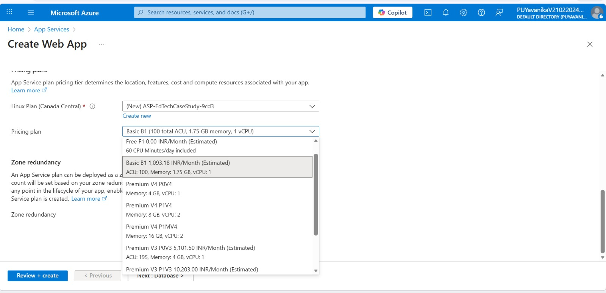
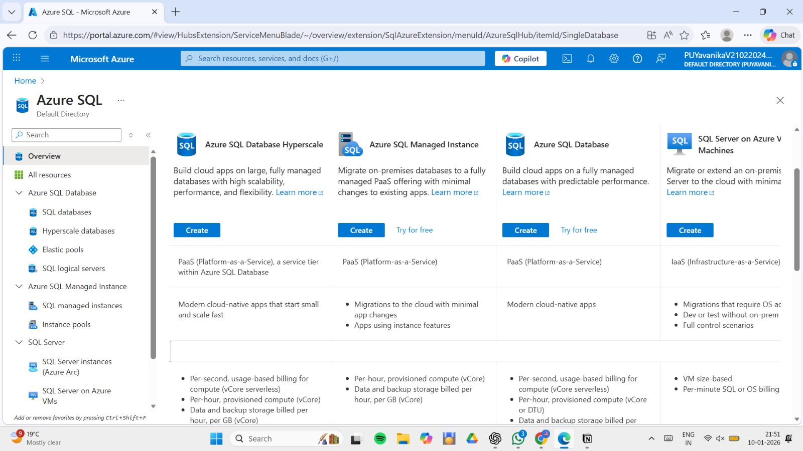
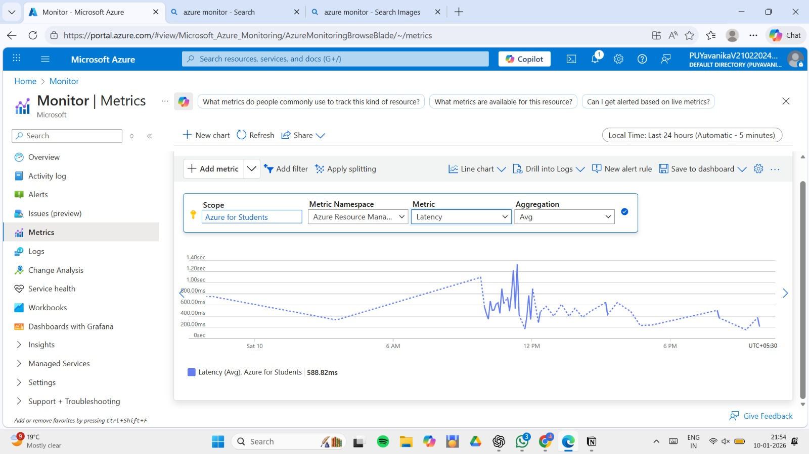
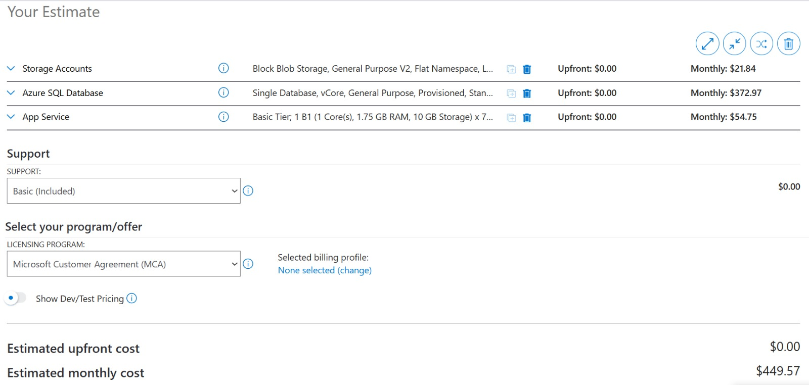

# Designing a Cost-Aware Azure PaaS Architecture (AZ-900)

## Overview
This repository contains a design-first cloud architecture case study created as part of Microsoft Azure Fundamentals (AZ-900).
The project focuses on architectural decision-making, service model comparison, cost awareness, and practical validation of Azure managed services.

## Problem Statement
A small ed-tech startup plans to migrate its application to Microsoft Azure.
The system must handle variable traffic patterns, protect student data, and remain cost-efficient while being managed by a small technical team.

## Key Constraints
- Limited monthly cloud budget  
- No dedicated cloud operations team  
- Unpredictable traffic spikes  
- Data privacy and security requirements  
- Need for high availability without over-engineering  

## Architecture Options Considered
- **IaaS-heavy architecture** – Full control but high operational overhead  
- **PaaS-first architecture (Selected)** – Managed services with built-in scalability  
- **Serverless architecture** – Event-driven but less suitable for continuous workloads  

## Final Architecture Decision
A PaaS-first architecture was selected to balance scalability, cost predictability, and operational simplicity.
Managed services such as Azure App Service and Azure SQL Database reduce infrastructure management effort while providing built-in availability.

## Architecture Diagram

## Practical Validation

The proposed architecture was validated using Azure Portal and Azure Pricing Calculator to ensure feasibility before deployment.

### Azure App Service Validation

### Azure SQL Database Validation

### Azure Monitor Validation

### Cost Estimation Using Azure Pricing Calculator

## Key Learnings
- Cloud architecture decisions are driven by constraints, not tools  
- Managed services reduce operational complexity  
- Cost awareness is essential before deployment  
- Design validation is as important as implementation  

## Certification Reference
Microsoft Azure Fundamentals (AZ-900)
